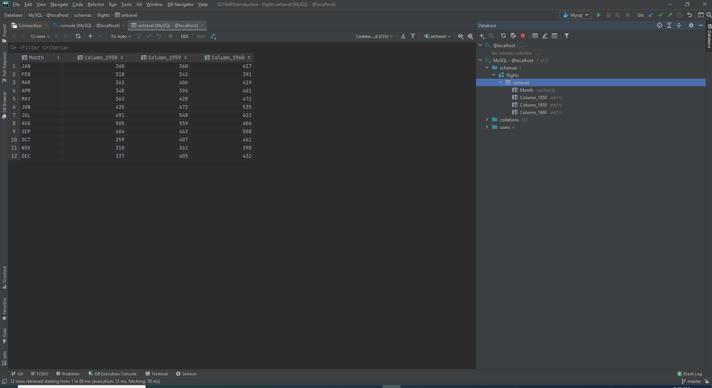
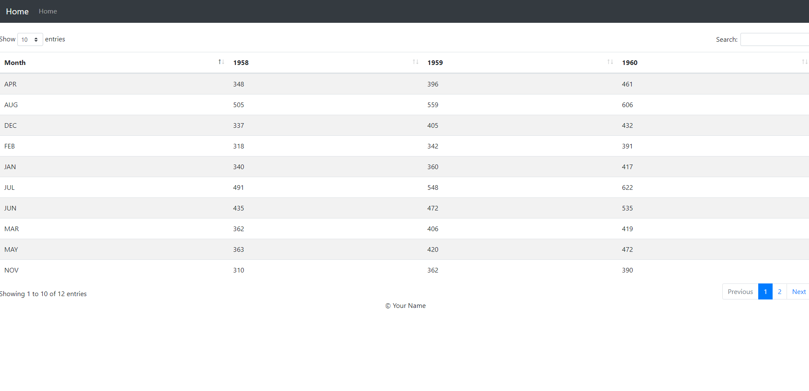
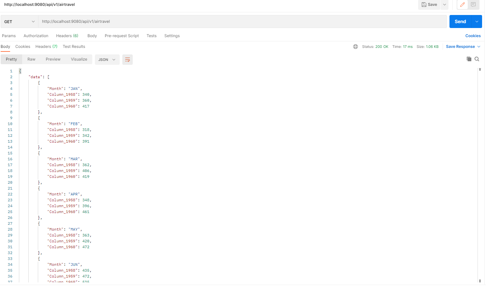
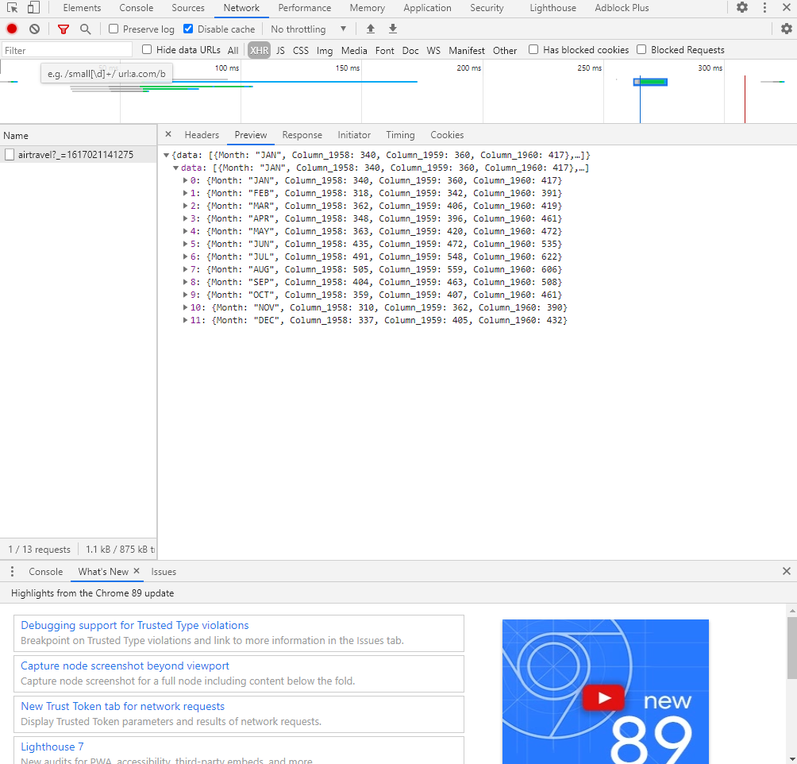

# API Introduction and Setup an API Server with MySQL and Express

## Overview

a. The project showing that you can view YOUR data tables in WebStorm

b. YOUR project running correctly in the browser displaying a data table

c. A screen shot of Postman and YOUR data returned from the project.

d. A screen shot of the browser console showing the XHR network request made from the browser when the page loads.

